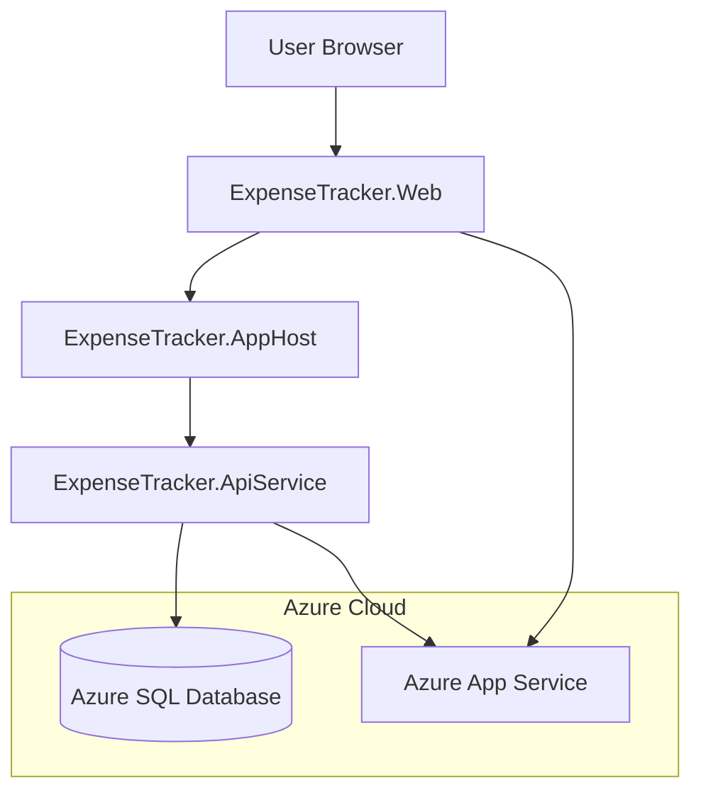

# System Patterns

## Architecture Overview

The Expense Tracker follows a modern web application architecture using .NET Aspire:



## Key Components

- **ExpenseTracker.Web**: Blazor Server frontend with Razor Components
- **ExpenseTracker.ApiService**: Backend API for expense data operations
- **ExpenseTracker.AppHost**: Orchestration of services using Aspire
- **ExpenseTracker.ServiceDefaults**: Common service configurations
- **Azure SQL Database**: Data persistence using free tier

## Data Models

### Core Expense Model

```csharp
public class Expense
{
    public int Id { get; set; }
    public string Description { get; set; }
    public DateTime Date { get; set; }
    public decimal Amount { get; set; }
    public PaymentSource PaidBy { get; set; }
    public SplitType SplitType { get; set; }
    public decimal? YourPercentage { get; set; }
    public decimal? PartnerPercentage { get; set; }
    public string Currency { get; set; }
    public string Category { get; set; }
    public string Notes { get; set; }
    public DateTime CreatedAt { get; set; }
    public DateTime? UpdatedAt { get; set; }
    public string CreatedBy { get; set; }
}
```

### User Authorization Model

```csharp
public class AuthorizedUser
{
    public int Id { get; set; }
    public string Email { get; set; }
    public string Name { get; set; }
    public bool IsAdmin { get; set; }
}
```

## Authentication & Authorization

- Google authentication for secure login
- Database-driven user authorization
- Development bypass for local testing
- Admin interface for user management

## API Design

RESTful API endpoints for expense operations:

- GET /api/expenses - List expenses with filtering
- GET /api/expenses/{id} - Get specific expense
- POST /api/expenses - Create expense
- PUT /api/expenses/{id} - Update expense
- DELETE /api/expenses/{id} - Delete expense

## Security Patterns

### Sensitive Information Handling

- Using Aspire parameter resources for sensitive information like database passwords
- Example: `var sqlPassword = builder.AddParameter("sqlPassword", Environment.GetEnvironmentVariable("SQL_PASSWORD") ?? throw new InvalidOperationException("SQL_PASSWORD environment variable not set."));`
- Passing parameter resources to service configurations instead of string literals
- Reading sensitive information from environment variables instead of hardcoding

## Coding Conventions

### C# Language Features

- Using target-typed new expressions for cleaner code (e.g., `List<string> items = new()` instead of `List<string> items = new List<string>()`)
- Leveraging nullable reference types for better null safety
- Using pattern matching where appropriate
- Preferring expression-bodied members for concise methods and properties

## Testing Patterns

### Unit Testing

- Using xUnit as the testing framework
- In-memory database for data access testing
- Mocking dependencies with Moq
- TestBase class for common test setup

### Integration Testing

- Using Microsoft.AspNetCore.Mvc.Testing for testing API endpoints
- WebApplicationFactory for creating test server
- In-memory database for integration tests
- PreserveCompilationContext set to true in test project

### Test Structure

#### Unit Tests

```csharp
public class ExpensesControllerTests : TestBase
{
  [Fact]
  public async Task GetExpenses_ReturnsAllExpenses()
  {
    // Arrange
    using var context = CreateDbContext();
    var logger = CreateLogger<ExpensesController>();
    var controller = new ExpensesController(context, logger);

    // Add test data to context

    // Act
    var result = await controller.GetExpenses();

    // Assert
    var actionResult = Assert.IsType<ActionResult<IEnumerable<Expense>>>(result);
    var returnValue = Assert.IsAssignableFrom<IEnumerable<Expense>>(actionResult.Value);
    Assert.Equal(expectedCount, returnValue.Count());
  }
}
```

#### Integration Tests

```csharp
public class ApiEndpointsTests : IClassFixture<WebApplicationFactory<Program>>
{
  private readonly WebApplicationFactory<Program> _factory;

  public ApiEndpointsTests(WebApplicationFactory<Program> factory)
  {
    _factory = factory.WithWebHostBuilder(builder =>
    {
      builder.ConfigureServices(services =>
      {
        // Configure test services
        var descriptor = services.SingleOrDefault(d => d.ServiceType == typeof(DbContextOptions<ApplicationDbContext>));
        if (descriptor != null)
        {
          services.Remove(descriptor);
        }

        services.AddDbContext<ApplicationDbContext>(options =>
        {
          options.UseInMemoryDatabase("TestDatabase");
        });
      });
    });
  }

  [Fact]
  public async Task GetExpenses_ReturnsSuccessAndAllExpenses()
  {
    // Arrange
    var client = _factory.CreateClient();

    // Act
    var response = await client.GetAsync("/api/expenses");

    // Assert
    response.EnsureSuccessStatusCode();
    var content = await response.Content.ReadAsStringAsync();
    var expenses = JsonSerializer.Deserialize<List<Expense>>(content, new JsonSerializerOptions { PropertyNameCaseInsensitive = true });
    Assert.NotNull(expenses);
  }
}
```

### Integration Test Issues

- Missing `testhost.deps.json` file causing test failures
- Error: `System.ArgumentException : Argument --parentprocessid was not specified`
- Potential solutions:
  - Investigate shadow copying settings
  - Review test runner configuration
  - Ensure proper test host setup
