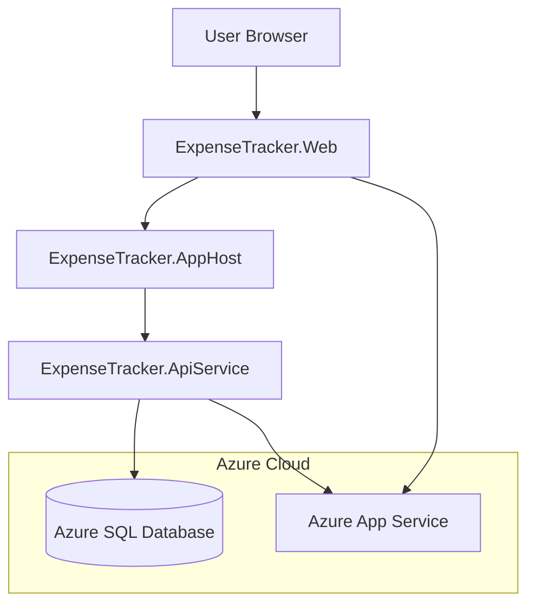

# System Patterns

## Architecture Overview

The Expense Tracker follows a modern web application architecture using .NET Aspire:



## Key Components

- **ExpenseTracker.Web**: Blazor Server frontend with Razor Components
- **ExpenseTracker.ApiService**: Backend API for expense data operations
- **ExpenseTracker.AppHost**: Orchestration of services using Aspire
- **ExpenseTracker.ServiceDefaults**: Common service configurations
- **Azure SQL Database**: Data persistence using free tier

## Data Models

### Core Expense Model

```csharp
public class Expense
{
    public int Id { get; set; }
    public string Description { get; set; }
    public DateTime Date { get; set; }
    public decimal Amount { get; set; }
    public PaymentSource PaidBy { get; set; }
    public SplitType SplitType { get; set; }
    public decimal? YourPercentage { get; set; }
    public decimal? PartnerPercentage { get; set; }
    public string Currency { get; set; }
    public string Category { get; set; }
    public string Notes { get; set; }
    public DateTime CreatedAt { get; set; }
    public DateTime? UpdatedAt { get; set; }
    public string CreatedBy { get; set; }
}
```

### User Authorization Model

```csharp
public class AuthorizedUser
{
    public int Id { get; set; }
    public string Email { get; set; }
    public string Name { get; set; }
    public bool IsAdmin { get; set; }
}
```

## Authentication & Authorization

- Google authentication for secure login
- Database-driven user authorization
- Development bypass for local testing
- Admin interface for user management

## API Design

RESTful API endpoints for expense operations:

- GET /api/expenses - List expenses with filtering
- GET /api/expenses/{id} - Get specific expense
- POST /api/expenses - Create expense
- PUT /api/expenses/{id} - Update expense
- DELETE /api/expenses/{id} - Delete expense

## Security Patterns

### Sensitive Information Handling

- Using Aspire parameter resources for sensitive information like database passwords
- Example: `var sqlPassword = builder.AddParameter("sqlPassword", Environment.GetEnvironmentVariable("SQL_PASSWORD") ?? throw new InvalidOperationException("SQL_PASSWORD environment variable not set."));`
- Passing parameter resources to service configurations instead of string literals
- Reading sensitive information from environment variables instead of hardcoding
